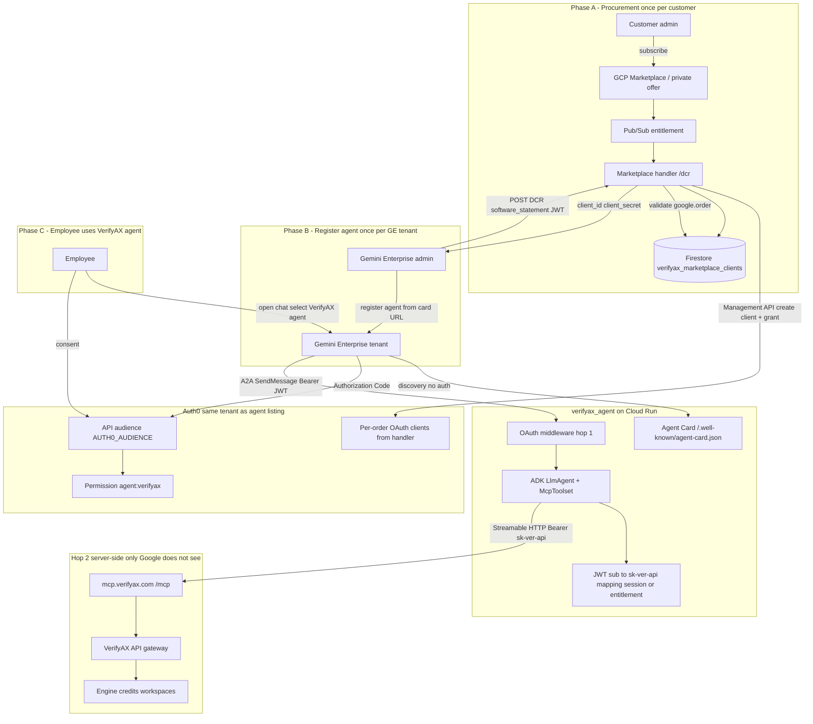
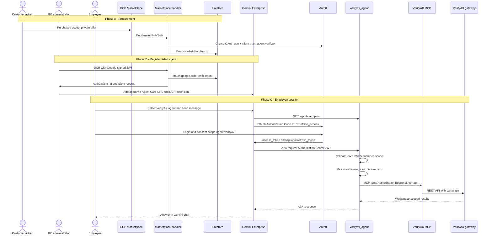
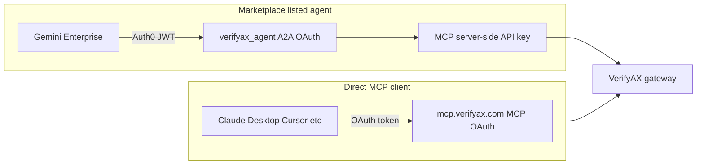
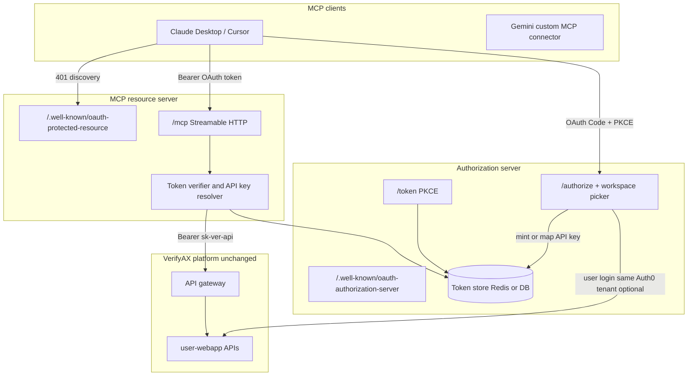

# OAuth 2.0 for VerifyAX MCP (architecture design)

Design for **OAuth 2.0** on VerifyAX in two integration shapes:

1. **Gemini Cloud Marketplace (recommended for VerifyAX agent listing)** — one user login via Auth0 on the **A2A agent**; MCP is called **only server-side** with `sk-ver-api-…` (no public MCP OAuth required).
2. **Direct MCP clients** (Claude Desktop, Cursor, Gemini custom MCP connector) — OAuth on **`https://mcp.verifyax.com`** per MCP spec (RFC 9728 / 8414).

The **VerifyAX platform gateway** always receives **`sk-ver-api-…`** on REST calls; gateway auth does not change.

**Status:** proposed  
**Audience:** engineers implementing MCP OAuth, the Marketplace listed agent (`gcp-marketplace-agent-connector`), and client integrations.

---

## 1. Goals and non-goals

### Goals

- Document **end-to-end auth** from GCP Marketplace procurement through Gemini Enterprise to VerifyAX tool calls.
- For **direct MCP HTTP clients**, support OAuth 2.1-style discovery and **Authorization Code + PKCE**, mapping tokens to API keys server-side.
- Bind every VerifyAX operation to **`organization_uuid`**, **`user_uuid`**, **`workspace_uuid`** via API keys (minted or mapped).
- **Do not change** platform gateway authentication (`ApiKeyStrategy` / `POST /api/v1/api-keys/validate`).
- **Keep backward compatibility** for `Authorization: Bearer sk-ver-api-…` on hosted MCP (stdio, legacy HTTP, agent hop 2).

### Non-goals

- Replacing console **Auth0 + session cookie** login for the web app.
- OAuth on **stdio** MCP (env `VERIFYAX_API_KEY` remains).
- Returning **plaintext API keys** to end-user clients after OAuth (tokens only for MCP OAuth path).
- Requiring **employees to OAuth twice** for Marketplace (agent OAuth only; not a separate MCP browser login).

---

## 2. Current state

| Component                                          | Auth today                                                       | Notes                                                                               |
| -------------------------------------------------- | ---------------------------------------------------------------- | ----------------------------------------------------------------------------------- |
| **Hosted MCP** (`packages/mcp-server/src/http.ts`) | `Bearer sk-ver-api-…` or `X-VerifyAX-API-Key` on every request   | OAuth on public MCP is roadmap; see [§5](#5-direct-mcp-clients-oauth-proxy-pattern) |
| **Platform gateway**                               | `sk-ver-api-…` → tenant UUIDs                                    | `verification/.../ApiKeyStrategy.ts`                                                |
| **API keys**                                       | Plaintext shown **once** at create; DB stores hash               | Cannot recover secret by `(org, user, workspace)`                                   |
| **Marketplace agent**                              | Hop 1: Auth0 JWT on `/a2a/verifyax_agent`; hop 2: API key to MCP | `gcp-marketplace-agent-connector`                                                   |

---

## 3. Gemini Cloud Marketplace — full flow (listed VerifyAX agent)

This is the **primary path** for **VerifyAX for Gemini Enterprise**: Agent-as-a-Service on GCP Marketplace with A2A, Agent Card, OAuth 2.0, and DCR. Gemini Enterprise **never** calls `mcp.verifyax.com` as an MCP client; only **`verifyax_agent`** does, from Cloud Run.

### 3.1 Architecture (procurement → registration → daily use)

### 3.2 Sequence (phases A–C)

### 3.3 Two hops (Marketplace)

| Hop   | Caller → callee                            | Credential                                                                              | Purpose                                                                                                                                                         |
| ----- | ------------------------------------------ | --------------------------------------------------------------------------------------- | --------------------------------------------------------------------------------------------------------------------------------------------------------------- |
| **1** | Gemini Enterprise → `verifyax_agent` (A2A) | Auth0 **access token** (JWT), scope **`agent:verifyax`**, audience **`AUTH0_AUDIENCE`** | Marketplace / GE requirement; [`oauth_middleware.py`](https://github.com/verifyax/gcp-marketplace-agent-connector/blob/main/verifyax_agent/oauth_middleware.py) |
| **2** | `verifyax_agent` → `mcp.verifyax.com`      | **`sk-ver-api-…`** (server-side only)                                                   | VerifyAX identity, credits, workspace isolation; gateway unchanged                                                                                              |

**Important:** Hop 1 proves the employee may use the **listed agent**. Hop 2 proves **which VerifyAX workspace** pays for MCP tools. The Auth0 JWT does **not** include `workspace_uuid` or billing context by default.

### 3.4 Reusing the same Auth0 OAuth for MCP (Marketplace answer)

| Question                                                                      | Answer                                                                                                                                                                                                                      |
| ----------------------------------------------------------------------------- | --------------------------------------------------------------------------------------------------------------------------------------------------------------------------------------------------------------------------- |
| Must `mcp.verifyax.com` expose OAuth for Marketplace listing?                 | **No.** GE talks A2A to your agent only.                                                                                                                                                                                    |
| Can GE forward the **same** access token to MCP?                              | **No** — GE does not call MCP; even if it did, hosted MCP and the gateway expect **`sk-ver-api-…`**, not Auth0 JWTs.                                                                                                        |
| Can we use the **same Auth0 tenant / same user login** for VerifyAX identity? | **Yes** — one browser consent for hop 1. Map **`sub`** (and optional `email`) from `request.state.token_info` to a VerifyAX API key **inside the agent**, then keep using `verifyax_mcp_headers` / session state for hop 2. |
| Should the agent send the Auth0 JWT to MCP instead of an API key?             | **Not recommended** without MCP changes **and** a mapping layer; JWT still does not replace gateway API keys.                                                                                                               |

**Recommended Marketplace pattern (single login UX):**

1. Employee completes **only** GE → Auth0 login (`agent:verifyax`).
2. On each A2A request, agent validates JWT and resolves **`sk-ver-api-…`** via one of:
   - **Entitlement provisioning** — marketplace handler stores a per-customer or per-user key in Firestore / Secret Manager at purchase.
   - **Account linking** — map `auth0_sub` → encrypted API key (mint once via existing create-key API when user links VerifyAX account).
   - **Chat paste** (interim) — `set_verifyax_api_key` after hop 1 (current connector behavior).
3. ADK `McpToolset` continues **`header_provider`** with `Bearer sk-ver-api-…`; no MCP OAuth discovery for this path.

**Optional later:** same Auth0 tenant, **second API audience** (e.g. `mcp:verifyax`) for **direct** MCP clients only — not required for the listed agent.

### 3.5 Auth0 objects (Marketplace agent — already in connector)

| Object                                                             | Role                                            |
| ------------------------------------------------------------------ | ----------------------------------------------- |
| Auth0 **API** (`AUTH0_AUDIENCE`) + permission **`agent:verifyax`** | JWT for A2A                                     |
| **Default Audience** on tenant                                     | GE often omits `audience` query param           |
| **Marketplace handler** M2M app                                    | Creates per-order Auth0 clients + client grants |
| **DCR** (`agent.json` extension → handler `/dcr`)                  | GE obtains `client_id` / `client_secret`        |
| Agent Card **`oauth2`** URLs                                       | `authorizationUrl` / `tokenUrl` on card         |

See `gcp-marketplace-agent-connector/docs/AUTH0_SETUP.md` and `verifyax_agent/marketplace/README.md`.

### 3.6 What to build next (Marketplace + VerifyAX identity)

| Priority | Work                                                                     | Where                                                            |
| -------- | ------------------------------------------------------------------------ | ---------------------------------------------------------------- |
| P0       | Keep hop 1 Auth0 + DCR as today                                          | `gcp-marketplace-agent-connector`                                |
| P1       | Pass JWT claims from A2A into ADK session; resolve API key without paste | Agent executor / `verifyax_credentials.py`                       |
| P1       | Entitlement → API key or linking store                                   | Marketplace handler + Firestore                                  |
| P2       | Public MCP OAuth ([§5](#5-direct-mcp-clients-oauth-proxy-pattern))       | `verifyax-mcp` — for Claude/Cursor, **not** blocking Marketplace |

---

## 4. Integration paths at a glance

| Path                | User logins                        | OAuth surface                           | MCP auth                            |
| ------------------- | ---------------------------------- | --------------------------------------- | ----------------------------------- |
| **Marketplace A2A** | One (GE → Auth0 for agent)         | Agent Card on Cloud Run                 | Server-side `sk-ver-api-…`          |
| **Direct MCP HTTP** | One (client → auth server for MCP) | `/.well-known/oauth-protected-resource` | Bearer OAuth token → map to API key |

---

## 5. Direct MCP clients — OAuth proxy pattern

For clients that connect **directly** to `https://mcp.verifyax.com/mcp`, implement the auth proxy: MCP clients send **OAuth access tokens**; the MCP resource server validates tokens and uses **`sk-ver-api-…`** only on gateway calls.

### Roles (direct MCP)

| Role                     | Responsibility                                                                     |
| ------------------------ | ---------------------------------------------------------------------------------- |
| **MCP client**           | Discovery, PKCE, browser login, `Authorization: Bearer <oauth_access_token>`       |
| **Authorization server** | Login, workspace picker, code exchange; **mint or map** `sk-ver-api-…` server-side |
| **MCP resource server**  | RFC 9728 metadata, verify token, map to API key, run tools                         |
| **Platform backend**     | Unchanged API key auth                                                             |

---

## 6. End-to-end flows (direct MCP)

### 6.1 Discovery (unauthenticated)

1. Client calls `POST /mcp` without credentials.
2. MCP responds **401** with `WWW-Authenticate` and `resource_metadata` URL (RFC 9728).
3. Client loads protected resource metadata → authorization server (RFC 8414).
4. PKCE **S256** required.

Use `@modelcontextprotocol/sdk` helpers (`OAuthTokenVerifier`, `buildOAuthProtectedResourceMetadata`).

### 6.2 User login and workspace binding

1. Authorization Code + PKCE at auth server (can use **same Auth0 tenant** as console / Marketplace, **separate** OAuth application and scope e.g. `mcp:verifyax`).
2. Workspace picker when user has multiple workspaces.
3. Store API key material with grant — never return `sk-ver-api-…` to the client.

### 6.3 Token issuance and tool execution

Standard OAuth token response; client calls MCP with access token; MCP resolves key and invokes `@verifyax/sdk`.

---

## 7. API key resolution (no platform auth changes)

The gateway cannot accept OAuth tokens. Auth server or **Marketplace agent** must obtain **`sk-ver-api-…`**.

| Strategy                | When                                       | How                                                                           |
| ----------------------- | ------------------------------------------ | ----------------------------------------------------------------------------- |
| **Mint on authorize**   | First link per `(user, workspace, client)` | `POST .../api-keys/...` as user; store secret in token store or agent mapping |
| **Reuse mapping**       | Repeat logins                              | `(auth0_sub, workspace_uuid, client_id) → ciphertext`                         |
| **Entitlement / paste** | Marketplace or interim                     | Provision or user-supplied key once                                           |
| **Lookup by tuple**     | ❌                                         | Plaintext key not in DB                                                       |

Validate before MCP session: `usage.getBalance()` or `POST /api/v1/api-keys/validate`.

---

## 8. Access token design (direct MCP)

### 8.1 Recommended: opaque tokens + server-side store

Store `api_key_ciphertext`, tenant UUIDs, `expires_at`, `oauth_client_id` keyed by random `access_token`. Revocation = delete row.

### 8.2 Alternative: JWE between auth server and MCP

Stateless verify; weaker revocation.

### 8.3 What not to do

- Expose `sk-ver-api-…` in a JWT the **client** can read.
- Use one access token for **both** A2A (`agent:verifyax`) and public MCP without **audience** separation.

---

## 9. MCP resource server changes (`@verifyax/mcp-server`)

### 9.1 HTTP surface

| Path                                    | Purpose                                                  |
| --------------------------------------- | -------------------------------------------------------- |
| `/.well-known/oauth-protected-resource` | RFC 9728                                                 |
| `/mcp`                                  | OAuth **or** legacy API key (dual mode during migration) |

Auth server (e.g. `auth.verifyax.com`): RFC 8414, `/authorize`, `/token`, optional `/revoke`.

### 9.2 Session model

OAuth sessions: fingerprint **token id**; map to API key per request; re-check expiry/revocation each request (same spirit as current per-request key check in `http.ts`).

### 9.3 Configuration (illustrative)

| Variable                           | Description                                                                          |
| ---------------------------------- | ------------------------------------------------------------------------------------ |
| `VERIFYAX_MCP_OAUTH_ENABLED`       | Public MCP OAuth                                                                     |
| `VERIFYAX_MCP_TOKEN_STORE_URL`     | Redis for opaque tokens                                                              |
| `VERIFYAX_MCP_LEGACY_API_KEY_AUTH` | Allow direct `sk-ver-api-…` (default true; **required for Marketplace agent hop 2**) |

---

## 10. Security requirements

- **PKCE** for public MCP clients.
- **Short-lived** access tokens; refresh with rotation where needed.
- **Marketplace:** never log JWT or API keys; map `sub` in agent trust zone only.
- **Audit:** `user_uuid`, `workspace_uuid`, `client_id` — not secrets.
- **Key sprawl policy** for mint-on-link.

---

## 11. Authorization server placement

- **Option A:** Dedicated MCP auth service (workspace UI + token store).
- **Option B:** Auth0 Actions + minimal token service.

Marketplace **agent** OAuth stays on Auth0 as today; MCP auth can share the **tenant** but should use a **distinct API/scope** if both coexist.

---

## 12. Phased implementation

| Phase   | Deliverable                                                        | Blocks Marketplace?                        |
| ------- | ------------------------------------------------------------------ | ------------------------------------------ |
| **0**   | This doc                                                           | No                                         |
| **M1**  | JWT → API key mapping in listed agent                              | Improves UX (no paste)                     |
| **M2**  | Entitlement-provisioned keys in handler                            | Enterprise rollout                         |
| **1–6** | Public MCP OAuth ([§5](#5-direct-mcp-clients-oauth-proxy-pattern)) | **No** — parallel track for direct clients |

---

## 13. Testing strategy

- **Marketplace:** DCR negative tests, A2A 401/403, JWT claims, MCP tools with resolved key (no token to MCP).
- **Direct MCP:** RFC 9728/8414 contracts, PKCE failures, dual-auth regression with legacy API key header.

---

## 14. Open decisions

| #   | Question                             | Options                                      |
| --- | ------------------------------------ | -------------------------------------------- |
| 1   | Marketplace key source first         | Entitlement vs account link vs paste         |
| 2   | Same Auth0 API for agent + MCP       | Single audience vs `mcp:verifyax` second API |
| 3   | Sunset direct API key on public HTTP | Security vs agent hop 2 compatibility        |
| 4   | ADK `McpToolset` native MCP OAuth    | Wait vs agent-side key injection only        |

---

## 15. References

- Marketplace agent: `gcp-marketplace-agent-connector/README.md`, `docs/AUTH0_SETUP.md`, `verifyax_agent/marketplace/README.md`
- MCP implementation: `packages/mcp-server/src/http.ts`, `packages/mcp-server/src/auth.ts`
- Platform keys: `verification/backend/user-webapp/src/models/ApiKey.js`, gateway `ApiKeyStrategy`
- Execution backlog: `docs/PLAN.md`
